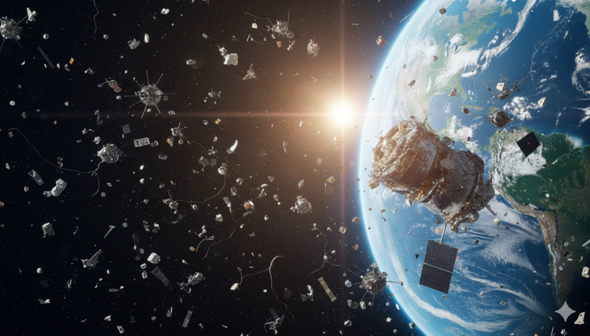

ES

# Proyecto de Mentoría - DiploDatos 2026

# 🛰🌎 **Predicciones en el Espacio: ¿Cuántos satélites y desechos podremos tener?**

## 📌 Descripción y objetivos del proyecto

En la última década, el número de satélites en órbita ha crecido exponencialmente debido a los avances tecnológicos, la reducción de costos de lanzamiento y el surgimiento del paradigma [New Space](https://www.earthdata.nasa.gov/s3fs-public/2023-11/newspace_nasa.pdf). Este modelo promueve ciclos de desarrollo más cortos, plataformas más pequeñas, reemplazos frecuentes y una mayor participación de actores privados.

En febrero de 2026, había aproximadamente [14.000 satélites activos en órbita](https://celestrak.org/NORAD/elements/table.php?GROUP=active&FORMAT=tle). Además, diversos estudios estiman que [más de un millón de proyectos satelitales han sido propuestos y se encuentran en diversas etapas de desarrollo](https://outerspaceinstitute.ca/osisite/wp-content/uploads/Onemillionpapersatellites-AcceptedVersion.pdf).

Un fenómeno particularmente relevante es el despliegue de grandes constelaciones, impulsadas por la comercialización global de servicios de comunicaciones, observación y conectividad. Esta expansión intensifica la ocupación de determinadas órbitas y plantea un escenario de [creciente competencia](https://www.adslzone.net/noticias/internet/amazon-leo-competencia-starlink-tiendas-fisicas/).

Sin embargo, este crecimiento trae asociado un problema cada vez más importante: [los desechos espaciales](https://www.argentina.gob.ar/sinagir/riesgos-frecuentes/chatarra-espacial). Estos desechos van desde satélites fuera de servicio hasta naves espaciales abandonadas, restos de lanzamientos y fragmentos producidos por misiones fallidas o colisiones. Según la [NASA](https://svs.gsfc.nasa.gov/5258/) y la [ESA](https://sdup.esoc.esa.int/discosweb/statistics/), actualmente hay más de 30.000 objetos rastreados en órbita, y también se lleva un [registro](https://spacesecurity.wse.jhu.edu/space-collisions/) de colisiones espaciales a lo largo del tiempo.

El desafío no es solamente contar cuántos objetos hay en órbita, sino entender qué características están asociadas a que un satélite u objeto orbital continúe activo, quede fuera de servicio o pase a formar parte de la población de objetos inactivos.

**El objetivo principal de este proyecto es desarrollar un modelo de aprendizaje automático que permita predecir si un objeto orbital va a seguir activo o no, o estimar su probabilidad de quedar fuera de servicio, a partir de sus características históricas, orbitales y de misión.**

En términos de modelado, el problema se plantea inicialmente como una tarea de **clasificación supervisada**, utilizando la variable `ACTIVE` como objetivo:

- `ACTIVE = Yes`: objeto activo.
- `ACTIVE = No`: objeto no activo.

El dataset contiene variables explicativas relevantes como `OBJECT_TYPE`, `COUNTRY`, `LAUNCH_YEAR`, `PERIOD`, `INCLINATION`, `APOGEE`, `PERIGEE`, `RCS_SIZE` y `PURPOSE`, entre otras. Esto permite construir modelos que estimen la probabilidad de actividad de un objeto y analizar qué factores influyen más en su estado operativo.

Como extensión del trabajo, también se podrá explorar la estimación de la vida útil real de los satélites, utilizando las fechas de lanzamiento (`LAUNCH`) y reentrada (`DECAY`) cuando estén disponibles. Este segundo objetivo es más desafiante porque muchos satélites activos todavía no tienen fecha de reentrada, por lo que la vida útil real no está completamente observada.

El proyecto busca responder las siguientes preguntas:

- **¿Cómo ha evolucionado la cantidad de satélites y desechos espaciales a lo largo del tiempo?**
- **¿Qué proporción de los objetos orbitales corresponde a satélites activos, objetos inactivos o desechos?**
- **¿Qué países u organizaciones concentran mayor cantidad de objetos en órbita?**
- **¿Qué características diferencian a los objetos activos de los no activos?**
- **¿Qué variables orbitales, históricas o de misión parecen estar asociadas al estado operativo?**
- **¿Existen patrones según tipo de objeto, propósito de misión, país responsable o tipo de órbita?**
- **¿Podemos predecir si un objeto orbital seguirá activo utilizando sus características disponibles?**
- **¿Qué información puede aportar el análisis de datos para anticipar escenarios de congestión o riesgo orbital?**

## 🗃 Datos

El dataset propuesto `satellites_202602.csv` contiene datos actualizados hasta febrero de 2026 y está conformado por:

- Registro histórico de misiones exitosas, obtenido de [Space-Track.org](https://www.space-track.org/).
- Datos de satélites activos orbitando la Tierra, obtenidos de [CelesTrack](https://celestrak.org/).
- Propósito de la misión obtenido de [UCS Satellite Database](https://www.ucs.org/resources/satellite-database), actualizado y corregido con criterio propio.

El archivo integra información sobre identificadores orbitales, tipo de objeto, país responsable, fecha de lanzamiento, fecha de reentrada, parámetros orbitales, tamaño estimado, estado activo y propósito de misión.

## 💻 Desarrollo

El desarrollo de este proyecto se divide de la siguiente manera:

- [Introducción a los Satélites](docs/intro_satelites.md)
- [Descripción de los Datos](docs/dataset.md)
- [Análisis y Visualización](docs/analisis_y_visualizacion.md)
- [Análisis Exploratorio y Curación de Datos](docs/analisis_exploratorio.md)
- [Aprendizaje Supervisado y/o No Supervisado](docs/aprendizaje.md)
- [Resultados y Conclusiones](docs/resultados.md)

## 📚 Referencias

- [Space-Track API](https://www.space-track.org/documentation#/api)
- [CelesTrack: Active Satellites](https://celestrak.org/NORAD/elements/table.php?GROUP=active&FORMAT=tle)
- [Union of Concerned Scientists - Satellite Database](https://www.ucs.org/resources/satellite-database)
- [ISS Tracker](https://isstracker.pl/en)
- [How many satellites can we safely fit in Earth orbit?](https://www.n2yo.com/satellite-article/How-many-satellites-can-we-safely-fit-in-Earth-orbit/86)
- [Too many satellites? Earth's orbit is on track for a catastrophe - but we can stop it](https://phys.org/news/2026-02-satellites-earth-orbit-track-catastrophe.html)
- [Satellite megaconstellations continue to grow. Could their debris fall on us?](https://www.space.com/space-exploration/satellites/satellite-megaconstellations-continue-to-grow-could-their-debris-fall-on-us)
- [Jonathan's Space Pages Satellite statistics: Satellite and Debris Population](https://planet4589.org/space/stats/active.html)
- Kessler, D. J. (1991). Collisional cascading: The limits of population growth in low Earth orbit. Advances in Space Research, 11(12), 63-66.

</b>
 EnzoRg | <a href="/README.md">Contenidos</a>

EN

# Mentorship Project - DiploDatos 2026

# 🛰🌎 **Predictions in Space: How Many Satellites and Debris Objects Can We Have?**

## 📌 Project description and objectives

Over the last decade, the number of satellites in orbit has grown exponentially due to technological advances, lower launch costs, and the emergence of the [New Space](https://www.earthdata.nasa.gov/s3fs-public/2023-11/newspace_nasa.pdf) paradigm. This model promotes shorter development cycles, smaller platforms, frequent replacements, and greater participation from private actors.

As of February 2026, there were approximately [14,000 active satellites in orbit](https://celestrak.org/NORAD/elements/table.php?GROUP=active&FORMAT=tle). In addition, several studies estimate that [more than one million satellite projects have been proposed and are at different stages of development](https://outerspaceinstitute.ca/osisite/wp-content/uploads/Onemillionpapersatellites-AcceptedVersion.pdf).

A particularly relevant phenomenon is the deployment of large constellations, driven by the global commercialization of communication, observation, and connectivity services. This expansion intensifies the occupation of certain orbits and creates a scenario of [increasing competition](https://www.adslzone.net/noticias/internet/amazon-leo-competencia-starlink-tiendas-fisicas/).

However, this growth is associated with an increasingly important problem: [space debris](https://www.argentina.gob.ar/sinagir/riesgos-frecuentes/chatarra-espacial). This debris ranges from decommissioned satellites to abandoned spacecraft, launch remnants, and fragments produced by failed missions or collisions. According to [NASA](https://svs.gsfc.nasa.gov/5258/) and the [ESA](https://sdup.esoc.esa.int/discosweb/statistics/), there are currently more than 30,000 tracked objects in orbit, and a [record](https://spacesecurity.wse.jhu.edu/space-collisions/) of space collisions over time is also maintained.

The challenge is not only to count how many objects are in orbit, but also to understand which characteristics are associated with whether a satellite or orbital object remains active, becomes inoperative, or becomes part of the inactive object population.

**The main objective of this project is to develop a machine learning model capable of predicting whether an orbital object will remain active or not, or estimating its probability of becoming inoperative, based on its historical, orbital, and mission-related characteristics.**

In modeling terms, the problem is initially formulated as a **supervised classification** task, using the `ACTIVE` variable as the target:

- `ACTIVE = Yes`: active object.
- `ACTIVE = No`: inactive object.

The dataset contains relevant explanatory variables such as `OBJECT_TYPE`, `COUNTRY`, `LAUNCH_YEAR`, `PERIOD`, `INCLINATION`, `APOGEE`, `PERIGEE`, `RCS_SIZE`, and `PURPOSE`, among others. This makes it possible to build models that estimate the probability that an object is active and analyze which factors have the greatest influence on its operational status.

As an extension of the project, the actual useful life of satellites may also be estimated using their launch (`LAUNCH`) and reentry (`DECAY`) dates, when available. This second objective is more challenging because many active satellites do not yet have a reentry date, meaning that their actual useful life has not been fully observed.

The project seeks to answer the following questions:

- **How has the number of satellites and space debris objects evolved over time?**
- **What proportion of orbital objects corresponds to active satellites, inactive objects, or debris?**
- **Which countries or organizations account for the largest number of objects in orbit?**
- **Which characteristics differentiate active objects from inactive ones?**
- **Which orbital, historical, or mission-related variables appear to be associated with operational status?**
- **Are there patterns according to object type, mission purpose, responsible country, or orbit type?**
- **Can we predict whether an orbital object will remain active using its available characteristics?**
- **What information can data analysis provide to anticipate orbital congestion or risk scenarios?**

## 🗃 Data

The proposed `satellites_202602.csv` dataset contains data updated through February 2026 and consists of:

- Historical records of successful missions obtained from [Space-Track.org](https://www.space-track.org/).
- Data on active satellites orbiting Earth obtained from [CelesTrack](https://celestrak.org/).
- Mission purposes obtained from the [UCS Satellite Database](https://www.ucs.org/resources/satellite-database), updated and corrected using our own criteria.

The file integrates information about orbital identifiers, object type, responsible country, launch date, reentry date, orbital parameters, estimated size, active status, and mission purpose.

## 💻 Development

The development of this project is divided into the following sections:

- [Introduction to Satellites](docs/intro_satelites.md)
- [Data Description](docs/dataset.md)
- [Analysis and Visualization](docs/analisis_y_visualizacion.md)
- [Exploratory Analysis and Data Curation](docs/analisis_exploratorio.md)
- [Supervised and/or Unsupervised Learning](docs/aprendizaje.md)
- [Results and Conclusions](docs/resultados.md)

## 📚 References

- [Space-Track API](https://www.space-track.org/documentation#/api)
- [CelesTrack: Active Satellites](https://celestrak.org/NORAD/elements/table.php?GROUP=active&FORMAT=tle)
- [Union of Concerned Scientists - Satellite Database](https://www.ucs.org/resources/satellite-database)
- [ISS Tracker](https://isstracker.pl/en)
- [How many satellites can we safely fit in Earth orbit?](https://www.n2yo.com/satellite-article/How-many-satellites-can-we-safely-fit-in-Earth-orbit/86)
- [Too many satellites? Earth's orbit is on track for a catastrophe - but we can stop it](https://phys.org/news/2026-02-satellites-earth-orbit-track-catastrophe.html)
- [Satellite megaconstellations continue to grow. Could their debris fall on us?](https://www.space.com/space-exploration/satellites/satellite-megaconstellations-continue-to-grow-could-their-debris-fall-on-us)
- [Jonathan's Space Pages Satellite statistics: Satellite and Debris Population](https://planet4589.org/space/stats/active.html)
- Kessler, D. J. (1991). Collisional cascading: The limits of population growth in low Earth orbit. Advances in Space Research, 11(12), 63-66.

</b>
 EnzoRg | <a href="/README.md">Contents</a>

