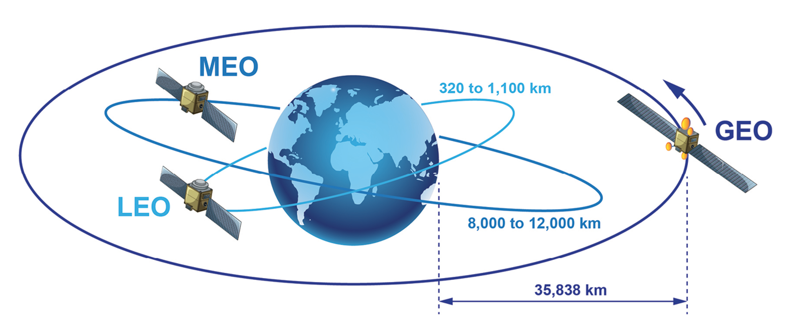
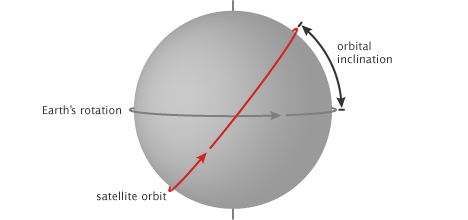

## Introducción a los Satélites

## 🤔 ¿Qué es un satélite?

Un satélite es un objeto que se mueve alrededor de otro más grande. Por ejemplo, la Tierra es un satélite del Sol, ya que orbita a su alrededor. La Luna es un satélite de la Tierra. Estos son satélites **naturales**.

Cuando hablamos de satélites, nos referimos a los **artificiales**: máquinas construidas por seres humanos y lanzadas al espacio para orbitar la Tierra u otros cuerpos celestes. En adelante, usaremos el término "satélite" para referirnos a estos dispositivos artificiales.

Existen miles de satélites artificiales. Algunos toman imágenes de la Tierra, de otros planetas, del Sol o del universo. Estos ayudan a la investigación y desarrollo científico. También hay satélites diseñados para telecomunicaciones, transmisión de televisión, acceso a Internet, navegación GPS, vigilancia, entre otros usos.

## 📺 ¿Por qué son importantes?

Antes de los satélites, las señales de TV no viajaban muy lejos. Las señales solo podían viajar en línea recta. Entonces, se iban fuera del espacio sin seguir la curvatura de la Tierra, y también podían ser bloqueadas por montañas o edificios.

Las llamadas telefónicas desde distancias lejanas también eran un problema. Su costo era muy elevado y era difícil utilizar cables por largas distancias y por debajo del agua.

Tampoco era posible observar la Tierra desde el espacio. La información sobre el clima, los océanos, los incendios o los cultivos dependía únicamente de observaciones desde la superficie. Esto limitaba mucho la capacidad de anticiparse a fenómenos naturales o de monitorear grandes áreas.

Además, el acceso a internet en regiones alejadas o rurales era muy limitado o incluso inexistente, ya que dependía de infraestructura terrestre costosa y difícil de instalar.

Con los satélites, este tipo de señales y otras (Internet, GPS y observación de la Tierra) pueden ser enviadas a un satélite y este puede reenviarlas a otra parte del planeta. Esto permite una cobertura global, mayor velocidad en las comunicaciones y la posibilidad de monitorear continuamente lo que ocurre en nuestro planeta desde el espacio.

## 🛰 Clasifición 

Un satélite esta compuesto principalmente por dos partes: plataforma y la carga útil (payload). Este última es la que cumple la función para la cual fue contruido el satélite. Se pueden clasificar según el propósito:

* **Comunicaciones**
* **Navegación y posicionamiento**
* **Observación de la Tierra**
* **Ciencia espacial**
* **Desarrollo tecnológico**
* **Otros usos específicos**

### 🛤️ Tipos de órbitas

Los satélites también se clasifican según la **órbita** en la que se encuentran. Existen tres categorías principales:

* **Órbita terrestre baja (LEO)**: entre 160 y 2.000 km de altitud.
* **Órbita terrestre media (MEO)**: entre 2.000 y 35.786 km.
* **Órbita geoestacionaria (GEO)**: a 35.786 km sobre el ecuador.

Muchos satélites científicos, de observación terrestre y sistemas como **Starlink** operan en órbita **LEO**. 

### ⏱ Velocidad 

La velocidad con la que un satélite orbita depende de su altitud. Cuanto más cerca de la Tierra, mayor es la fuerza gravitacional y, por lo tanto, mayor su velocidad orbital. Por ejemplo:

* A **705 km**, un satélite tarda unos **99 minutos** en completar una vuelta.
* A **36.000 km**, tarda casi **24 horas** (23h 56m 4s), lo que permite que permanezca fijo sobre un mismo punto de la Tierra.
* La **Luna**, a más de 384.000 km, tarda **aproximadamente 28 días**.

Esto fue descripto hace siglos por las [Leyes de Kepler](https://es.wikipedia.org/wiki/Leyes_de_Kepler).

### 🧭 Inclinación orbital

La inclinación es el ángulo entre el plano de la órbita del satélite y el ecuador terrestre:

* Una inclinación de **0°** significa que orbita sobre el ecuador.
* Una inclinación de **90°** indica una órbita polar, es decir, sobre los polos geográficos.

##

Siguiente | <b><a href="dataset.md">Descripción de los Datos</a></b>
 
Atrás | <b><a href="README.md">Página principal</a>

</b>
 EnzoRg | <a href="../README.md">Contenidos</a>

