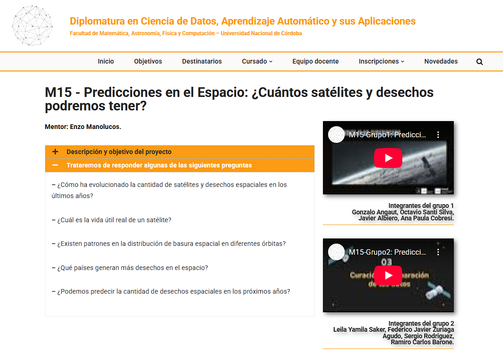

# Resultados y Conclusiones 

En el marco de la [Diplomatura en Ciencia de Datos, Aprendizaje Automático y sus Aplicaciones](https://diplodatos.famaf.unc.edu.ar/), los alumnos desarrollaron sus trabajos finales los conceptos vistos en la diplomatura sobre un dataset real. Como cierre del trabajo, realizaron una serie de [videos](https://diplodatos.famaf.unc.edu.ar/metodologia-y-modalidad-de-cursado/mentorias/mentorias-trabajos-finales-2025/m15-2025/) donde muestran paso a paso el proceso para realizar este tipo de proyectos: análisis exploratorio de los datos, extracción y transformación, entrenamiento de modelos y evaluación de los resultados. 

  

Durante el dessarrollo se obtuvieron resultados que permiten entender mejor el comportamiento actual de los desechos espaciales. En particular, los modelos lograron capturar patrones temporales y relaciones entre variables, referidas a las orbitas, que no son evidentes a partir de un análisis descriptivo tradicional.

A nivel técnico, el trabajo dejó varias conclusiones claras. Por un lado, la calidad del preprocesamiento tiene un impacto directo en el desempeño de los modelos. Por otro lado, la comparación entre distintos enfoques permitió identificar que técnicas se adaptan mejor al problema y cuáles presentan mayores limitaciones según el tipo de datos disponibles. 

En conclusion, este proyecto muestra como la ciencia de datos pueden aportar valor en el análisis y la predicción de la dinámica de desechos espaciales. Estos resultados sientan una base sólida para futuros trabajos, ya sea incorporando nuevos, ajustando los modelos o explorando aplicaciones orientadas al monitoreo y la mitigación del riesgo en el entorno orbital. 

##

Atrás | <b><a href="aprendizaje.md">Aprendizaje Supervisado y/o No Supervisado</a>

</b>
 EnzoRg | <a href="../README.md">Contenidos</a>
